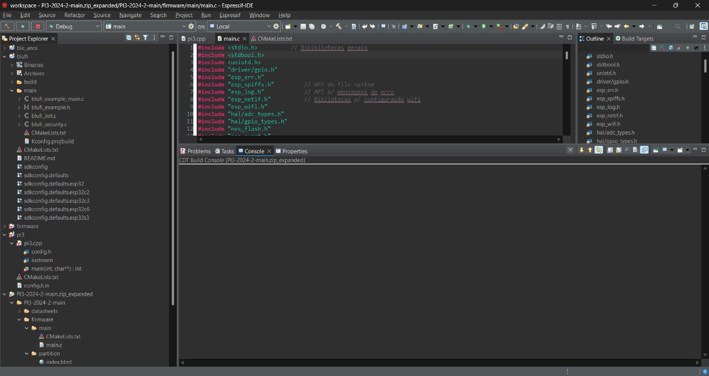

# PROJETO INTEGRADOR 3

## ETAPA 1:

### INTRODUÇÃO
Este projeto tem como o objetivo o desenvolvimento de um sistema embarcado completo para o monitoramento e controle de variáveis físicas na bancada MPS PA Compact Workstation, da Festo. A solução proposta será capaz de controlar, em tempo real, as variáveis de temperatura e nível, utilizando sensores e atuadores já integrados  à bancada. Todo o sistema de controle será implementado do zero, com código desenvolvido pela própria equipe, utilizando o microcontrolador ESP32. 

A arquitetura do sistema será composta por sensores analógicos e digitais conectados às entradas do microcontrolador, que serão responsáveis pela leitura contínua dos sinais de processo. Após a conversão e tratamento dos sinais, os valores medidos serão comparados com seus respectivos setpoints, definidos manualmente por meio de botões ou menus. O controle PID será implementado no firmware para garantir que as variáveis de nível de água e temperatura na bancada MPS PA Compact Workstation sejam controladas de maneira eficiente e precisa. 

Para garantir a visibilidade e a interação com o sistema, será utilizado um módulo wifi, onde será possível visualizar as grandezas medidas, os valores de referência, os sinais de controle calculados, além de mensagens de alerta e o status atual da operação, permitindo maior mobilidade e facilidade no acompanhamento do sistema. A interface vai permitir o ajuste interativo dos parâmetros do controlador PID (Kp, Ki, Kd) em tempo real. Isso permitirá que o usuário altere valores dos parâmetros e como afetam a resposta do sistema e ajudem a entender melhor o desempenho do controle de temperatura e nível de água.

Será desenvolvida toda a estrutura de controle, incluindo: 
* Leitura e filtragem dos sinais dos sensores analógicos e digitais;
* Conversão dos sinais para unidades físicas reais;
* Cálculo das variáveis de erro em relação aos setpoints;
* Aplicação do algoritmo PID com ajuste fino dos parâmetros Kp, Ki e Kd;
* Geração de sinais de saída compatíveis com os atuadores utilizados (ex: PWM para válvula, sinal contínuo para o aquecedor);
* Validação do controle com testes físicos em bancada, em condições variadas.

O sistema será modular, permitindo a ativação ou desativação de cada controle individualmente (por exemplo, testar o controle de nível isolado antes de integrá-lo ao controle de temperatura. Esse desenvolvimento modular facilita os testes, a depuração e possíveis expansões futuras. 

O sistema de controle PID será inicialmente ajustado por meio de simulações e, posteriormente, ajustado através de testes no laboratório. Esse recurso aumentará a flexibilidade do sistema, permitindo que ele seja adaptado facilmente a diferentes cenários e condições de operação.
Com as melhorias do firware, o sistema de controle PID proporcionará um controle mais preciso e poderão ser observador os efeitos dos ajuste no comportamento do sistema. 

Foram verificados quatro possíveis circuitos de malha fechada no manual, que podem ser usados individualmente e em cascata. 
* Sistema de controle do nível de água nos tanques;
* sistema de controle do fluxo de água;
* Sistema de controle de temperatura;
* Sistema de controle de pressão. 
______________________________________________________________________________________________

### JUSTICATIVA DA ESCOLHA DO ESP32 
O ESP32 é um microcontrolador de alto desempenho projetado para aplicações que exijam conectividade sem fio. Ele é popular IoT devido justamente a essa capacidade de se conectar a redes Wi-Fi e Bluetooth de forma eficiente, além de apresentar um desempenho para processamento e controle. 

A boa razão pela escolha do ESP32 é que ele combina um processador dual-core com Wi-Fi integrado, o que permite implementar soluções de controle remoto, com a capacidade de monitoramento em tempo real via internet. Além disso, o ESP tem uma facilidade de comunicação com outros dispositivos, como sensores e atuadores, o que contribui para sistemas interconectados em ambientes de automação.

Além disso, o ESP32 oferece recursos como ADC de alta resolução, interfaces seriais (UART, SPI, I2C), que permitem o controle preciso de sensores analógicos e digitais sem a necessidade de circuitos externos acoplados. A arquitetura é eficiente em termos de energia, que é crucial para dispositivos que necessitam de autonomia, sem comprometer o desempenho.

O ESP32 possui também bastante documentação, que facilita o desenvolvimento de aplicações. Com a disponibilização de ferramentas como o Arduino IDE, o microcontrolador se torna acessível para desenvolvimento e prototipagem, oferecendo uma variedade de bibliotecas e exemplos para rápida implementação.

A escolha do ESP32 oferece uma significativa vantagem ao projeto, em termos de conectividade, desempenho e custo-benefício. Além de permitir a integração eficiente de sistemas de monitoramento e controle com a infraestrutura da internet. Sua alta capacidade de processamento, combinada com o baixo consumo de energia, faz com que o ESP32 tenha sido escolhido para o projeto.

_______________________________________________________________________________________________

### SENSORES E ATUADORES DA BANCADA FESTO - MPS PA COMPACT WORKSTATION

### Lista de Sensores
	* Sensor de nível ultrassônico - B101
 	* Sensoores capaciitivo de proximidade - B113/B114
  	* Interruptores de nível tipo boia - S111/ S112/ S117
   	* Sensor de vazão - B102
	* Sensor de pressão - B103
	* Sensor de temperatura - B104

### Lista de Atuadores
	* Bomba centrífuga - P101
 	* Válvula proporcional para controle de vazão - V106
  	* Válvula esférica - V102
   	* Aquecedor - E104

_____________________________________________________________________________________________
 	
| **Descrição**                          | **Referência Datasheet** |
|----------------------------------------|---------------------------|
| Sensor de nível ultrassônico           | B101                      |
| Sensores capacitivo de proximidade     | B113 / B114               |
| Interruptores de nível tipo boia       | S111 / S112               |
| Sensor de vazão                        | B102                      |
| Sensor de pressão                      | B103                      |
| Sensor de temperatura                  | B104                      |

### Sensor de nível ultrassônico - B101

O sinal de corrente analógico (4 … 40 mA) do sensor ultrassônico (1) está conectado como um sinal padrão ao terminal análogico X2 (IE1) no canal 0. O sinal de corrente também está conectado ao transformador de medição A1, que converte o sinal de corrente analógico em um sinal de tensão padrão (0 … 10V). O sinal de tensão padrão também está conectado ao terminal analógico X2 (UE1).

### Sensores capacitivo de proximidade - B113 / B114

Dois interruptores de proximidade capacitivos, B113 (1) e B114 (2), estão localizados na lateral do tanque inferior B101 e montados em uma placa de perfil. Os interruptores de proximidade podem ser ajustados mecanicamente. A distância de detecção através da parede do tanque pode ser ajustada com um parafuso. Os sinais de entrada binários de 24V são conectados ao terminal de E/S XMA1. 

### Interruptores de nível tipo boia - S111 / S112 / S117

* **S111:** O transbordamento no tanque B101 é monitorado com o interruptor de boia. Se o nível no tanque exceder o nível máximo, o cilindro de boia transparente é empurrado para cima, ativando um contato reed. Os sinais de entrada binários de 24V (normalmente abertos) são conectados ao terminal de E/S XMA1.

* **S112:** Monitora o nível mínimo no tanque superior B102. Os sinais de entrada binários de 24V (normalmente fechados) são conectados ao terminal de E/S XMA1.

* **S117:** Monitora a diminuição do nível de enchimento do tanque B101, evitando que o aquecimento continue caso o nível fique abaixo do ponto crítico. O cabo do interruptor está conectado diretamente ao aquecimento.

### Sensor de vazão - B102

Um sinal de onda quadrada constante do sensor de vazão está conectado a uma entrada binária no terminal de E/S XMA1 (I0). O nível do sinal depende da tensão de alimentação aplicada (8 … 24 V). O sinal de frequência também está conectado ao transformador de medição A2, que converte o sinal em uma tensão padrão de 0 a 10 V.

### Sensor de pressão - B103

O sensor de pressão (2) piezoresistivo envia um sinal analógico de 0 a 10V de acordo com a pressão no tanque B103 entre 0 e 400 mbar.

### Sensor de temperatura - B104

A resistência do sensor de temperatura (2) está conectada ao transformador de medição A3, que converte a resistência em um sinal de tensão padrão (0 a 10 V), conectado ao terminal analógico X2 (UE4). O aquecimento é controlado por um relé interno, ativado por uma saída digital (O1 no XMA1).

________________________________________________________________________________________________
## Atuadores

### Bomba centrífuga - P101

A bomba(1) é acionada pelo controlador de motor A4 e pelo relé K1. Com uma saída digital (O2 no XMA1), é possível alternar entre controle binário e controle analógico (0 e 24V). No controle binário, a bomba é ligada/desligada com uma saída adicional (O3 no XMA1). No controle analógico, a tensão de acionamento define a velocidade da bomba(0 a 10V).

### Válvula proporcional para controle de vazão - V106

A eletrôncia de controle da válvula é ativada com uma saída binária (O4 no XMA1). Um sinal analógico do canal 1 (UA2 no X2) aciona a válvula com um sinal padrão de 0 a 10 V. 

### Válvula esférica - V102

O acessório de detecção de posição final é composto por dois micro relés elétricos. Os sinais binários de 24 VDC (S115 e S116) estão conectados como entradas no terminal de E/S XMA1. 

### Aquecedor - E104

O aquecimento é controlado internamente pela bancada, ativado por uma saída binário (O1 no XMA1). O controle do aquecimento pode ser binário ou contínuo (modulação por largura de pulso - PWM). 

## Tabelas de mapeamento

### Terminal I/O Digital 

A bancada utiliza um terminal I/O digital, identificado como XMA1, para comunicação entre os sensores de saída binária com sua interface. 

Esse terminal I/O possui uma conexão de 24 pinos padrão IEEE-488 a qual podemos utilizar em nosso benefício para comunicação entre o microcontrolador e a bancada. 
Dessa forma, utilizando as informações encontradas no datasheet da bancada e seu diagrama elétrico, foi feito o mapeamento de cada sensor e sua respectiva posição no terminal. Apresentados nas tabelas abaixo, divididos entre sensores e atuadores.
O terminal I/O digital trabalha com uma tensão de 24V, a qual precisaremos adequar para trabalhar com nosso microcontrolador que trabalha com tensão de 3.3V. 

| **Descrição**                        | **Símbolo**  | **Referência** | **Pino Terminal** |
|--------------------------------------|--------------|----------------|-------------------|
| Acionamento válvula esférica         | M102         | O0             | XMA1.1            |
| Aquecedor                            | E104         | O1             | XMA1.2            |
| Relé controle analógico da bomba     | K1           | O2             | XMA1.3            |
| Relé controle binário da bomba       | M1           | O3             | XMA1.4            |
| Acionamento válvula proporcional     | M106         | O4             | XMA1.5            |
| N/A                                  | N/A          | O5             | XMA1.6            |
| N/A                                  | N/A          | O6             | XMA1.7            |
| N/A                                  | N/A          | O7             | XMA1.8            |
| N/A                                  | 24V A        | 24V            | XMA1.9            |
| N/A                                  | 24V A        | 24V            | XMA1.10           |
| N/A                                  | GND A        | GND            | XMA1.11           |
| N/A                                  | GND A        | GND            | XMA1.12           |
| Sensor de vazão                      | B102         | I0             | XMA1.13           |
| Interruptor de nível tipo boia       | S111         | I1             | XMA1.14           |
| Interruptor de nível tipo boia       | S112         | I2             | XMA1.15           |
| Sensor capacitivo de proximidade     | B113         | I3             | XMA1.16           |
| Sensor capacitivo de proximidade     | B114         | I4             | XMA1.17           |
| Micro relé para válvula esférica (V102) | S115       | I5             | XMA1.18           |
| Micro relé para válvula esférica (V102) | S116       | I6             | XMA1.19           |
| N/A                                  | N/A          | I7             | XMA1.20           |
| N/A                                  | 24V B        | 24V            | XMA1.21           |
| N/A                                  | 24V B        | 24V            | XMA1.22           |
| N/A                                  | GND B        | GND            | XMA1.23           |
| N/A                                  | GND B        | GND            | XMA1.24           |

### Terminal I/O Analógico 

Os componentes analógicos da bancada também estão conectados a uma terminal I/O, identificado como X2, para facilitar a integração e comunicação. Todos os sinais são convertidos para níveis de tensão entre 0 e 10V, os quais teremos que adequar para leitura nos conversores analógico-digitais de nosso microcontrolador. 
Este terminal utiliza um conector D-Sub 15 pinos para comunicação com a interface, o qual utilizaremos em nosso benefício para conexão da nossa interface. Para isso, mapeamos os pinos do terminal e suas funções de controle dos componentes da bancada. 
| **Descrição**                             | **Símbolo** | **Atribuição de pinos** | **Referência** |
|-------------------------------------------|-------------|-------------------------|----------------|
| Bomba centrífuga                          | P101        | UA1                     | X2.1           |
| Válvula proporcional para controle de vazão | V106        | UA2                     | X2.2           |
| N/A                                       | N/A         | GND A                   | X2.3           |
| N/A                                       | N/A         | IE2                     | X2.4           |
| N/A                                       | N/A         | IE1                     | X2.5           |
| N/A                                       | N/A         | GND B                   | X2.6           |
| Sensor de vazão                           | FIC B102    | UE2                     | X2.7           |
| Sensor de nível ultrassônico              | LIC B101    | UE1                     | X2.8           |
| N/A                                       | N/A         | IA2                     | X2.9           |
| N/A                                       | N/A         | IA1                     | X2.10          |
| N/A                                       | N/A         | N.C.                    | X2.11          |
| N/A                                       | N/A         | IE4                     | X2.12          |
| N/A                                       | N/A         | IE3                     | X2.13          |
| Sensor de temperatura                     | TIC B104    | UE4                     | X2.14          |
| Sensor de pressão                         | PIC B103    | UE3                     | X2.15          |

___________________

### Tabela de componentes

| #  | Designator                | Description                                     | Quantity | Footprint         |
|----|---------------------------|-------------------------------------------------|----------|-------------------|
| 1  | C13, C14                  | CAP CER 100nF 50V X7R 0805                      | 2        | 0805C             |
| 2  | C1, C2, C3, C4, C5, C6, C9, C10, C11, C12 | CAP CER 10nF 50V X7R 0805         | 10       | 0805C             |
| 3  | R1, R2, R3, R4, R5, R6, R8, R9, R10, R11, R12 | RES 10K OHM 5% 1/8W 0805      | 11       | 0805R             |
| 4  | J1                        | BRB Matekts connector, 1x2, 180°                | 1        | BRB_1X2_M         |
| 5  | IC3, IC4, IC5, IC6, IC7, IC8, IC9, IC10, IC11, IC12, C13, C14 | Integrated Circuit PCB17C    | 12       | DIP762W60P254L854H530Q4N |
| 6  | IC1, IC2                  | Integrated Circuit LM324N/NOPB                 | 2        | DIP794W56P254L910H530Q4N |
| 7  | P3                        | Connector D15T08 Female, 180°, 2 Lines, 7&6 Columns, 26 Pins | 1 | ds1039             |
| 8  | P2                        | Connector D17T08 Female, 180°, 2 Lines, 12 Columns, 24 Pins | 1 | ds1039             |
| 9  | U1                        | IC MCU 32BIT ESP32 DEVKIT V1                   | 1        | ESP32-DEVKIT-V1   |
| 10 | M1                        | LM2596 4 PINS                                   | 1        | MOD_LM2596        |
| 11 | R26, R27, R35, R36        | RES 100 OHM 5% 1/8W                             | 4        | RESISTOR          |
| 12 | R13, R14, R15, R16        | RES 10K OHM 5% 1/8W                             | 4        | RESISTOR          |
| 13 | R28, R29, R30, R31        | RES 33K OHM 5% 1/8W                             | 4        | RESISTOR          |
| 14 | R32, R33, R34             | RES 47K OHM 5% 1/8W                             | 3        | RESISTOR          |
| 15 | R17, R18, R19, R20        | RES 68K OHM 5% 1/8W                             | 4        | RESISTOR          |
| 16 | D1, D2, D3, D4            | Schottky Diode                                  | 4        | SOT95P230X110-3N  |
| 17 | LCD1                     | 16×2 Dot Matrix LCD Display                     | 1        | LCD_16x2          |

### Fluxograma

## ETAPA 2:

# Circuito de interface ESP/Bancada

Início: O ESP é ligado e começa a executar o código que controla o processo. 

Conecta Wi-FI: O próximo passo é estabelecer uma conexão Wi-fi, que é essencial, pois será utilizada para a comunicação remota entre o micrcontrolador e o sistema de controle, permitindo o monitoramento em tempo real e o envio dos comandos para a bancada. 

Inicia Servidor WEB: O sistema configura e ativa um servidor web integrado ao ESP. Através dessa interface, é possível acessar a bancada remotamente, visualizar informações do processo e enviar comandos diretamente por um navegador.

Configura periféricos (ADC, Timers, GPIO): Nesta etapa, o microcontrolador configura os periféricos necessários, incluindo o conversor analógico-digital (ADC) para leitura de sensores, temporizadores para o controle de tarefas periódicas e os pinos de entrada/saída digital (GPIO) para o controle de atuadores e leitura de sensores digitais. 

Requisição de dados: COm o sistema configurado e em operação, ele monitora constantemente requisições externas. Esse ponto de decisão verifica se o sistema recebeu uma solicitação de dados de algum dispositivo externo. Caso não haja uma requisição de dados, o sistema retorna para o estado de espera, aguardando novas solicitações. Se houver uma requisição, o sistema processa o pedido. 

Retorna dado: Se é identificada uma requisição, o microcontrolador processa as informações solicitadas (como leitura de sensores ou estados dos atuadores) e as envia ao dispositivo solicitante via servidor web, permitindo o monitoramento remoto em tempo real. 

Esse processo garante que o usuário consiga acessar e controlar a bancada remotamente, monitorando e ajustando os parâmetros em tempo real por meio da interface web.

### Interface usuário/bancada

Foi definido que a interação do usuário com a bancada da FESTO vai ser via servidor web, como foi a da equipe do projeto anterior. O servidor possui alguns botões que permitem acionar algumas válvulas e captura dados em tempo real.

### Otimização da PCB

No projeto anterior, o optoacoplador (mostrado na imagem abaixo) não fornecia corrente o suficiente para acionar a válvula esférica, para corrigir esse problema, adicionamos um circuito de driver de corrente com resistor de pull up, que consegue entregar para a válvula os 200mA necessários.
Verificamos que o resistor de 10 kΩ presente na entrada do optoacoplador no circuito digital de acionamento (como mostrado na imagem abaixo) não fornecia corrente suficiente para polarizar o transistor na saída do optoacoplador, o que limitava a tensão de saída. Para a produção da placa, substituímos esse resistor por um de 1 kΩ

### Fabricação da PCB

Esquemático do circuito:
Na primeira etapa para a execução da placa foi importar o esquemático do projeto anterior, fazendo as alterações descritas no tópico de Otimização da PCB. 

Para a comunicação digital foram utilizados circuitos de chaveamento com optoacopladores para adequar os niveis de tensão de 24V.

Na parte analógica utilizamos amplificadores operacionais não inversores convertendo o sinal de 3,3V para 10V nas saídas. É um divisor resistivo junto de um circuito de proteção da ESP32 utilizando diodos e um amplificador operacional como seguidor de tensão.
Para a parte de alimentação foi utilizado um módulo pronto do LM2596.

  

### Código
O microcontrolador utilizado foi o ESP32 DEVKIT 1. Para compilação e testes do código do projeto, utilizaremos o ESPRESSIF IDE, que é uma IDE especifica dos ESPs. 
Foi configurada a interface da IDE e importado o código para o teste. 

  

### Fabricação do suporte
Um protótipo extra de suporte foi apresentado nesta etapa, devido à problemas na confecção do suporte oficial do projeto, que será em impressão 3D e encaixará na bancada de forma adequada. ]

## ETAPA 3:

## Otimização da PCB anterior
Na PCB que foi desenvolvida na etapa 2, verificamos alguns erros, como tamanho de footprint de conectores, do ESP e a placa não estava funcionando corretamente. 
Então, para esta etapa, foi desenvolvida uma nova placa, onde os erros foram consertados e optamos pela utilização de alguns componentes SMD, para que fosse mais fácil fazer a conexão dos cabos da bancada nos conectores da placa. 

## Substituição do suporte

A fabricação do suporte foi inicialmente desenvolvida em impressão 3D. Após modificarmos a placa, decidimos, por questões de estabilidade, construir um suporte feito de chapas de mdf, cortadas em laboratório e posicionadas na melhor posição para uma boa fixação na bancada. 

## Teste prático
Inicialmente, ligamos a bancada e fizemos a conexão com a nossa placa. A montagem pode ser visualizada nas imagens abaixo:

A página web, que monitora os valores lidos pelos sensores e contém os botões de acionamento, pode ser vista na figura abaixo. 

Nesta etapa, para conseguirmos fazer a parte de controle dos sensores e atuadores, nosso objetivo foi verificar quais sensores estavam devidamente funcionando e nos permitiriam fazer esta próxima etapa. 

[Vídeo do sensor de pressão](https://github.com/beatrizm18/PI3-2025-1/blob/main/imagens/videotestepressao.mp4)

[Vídeo da bomba funcionando](https://github.com/beatrizm18/PI3-2025-1/blob/main/imagens/bombafuncionando.mp4)

[Vídeo do sensor ultrassõnico](https://github.com/beatrizm18/PI3-2025-1/blob/main/imagens/ultrassonicofuncionando.mp4)

Foi feita uma tabela com esse monitoramento.

| **Componente**                        | **Código**  | **Status** |
|---------------------------------------|-------------|------------|
| Bomba                                 | P101        | OK         |
| Aquecedor                             | E104        | OK         | 
| Válvula proporcional                  | M106        | NÃO        |
| Solenoide                             | V106        | OK         | 
| Sensor de temperatura                 | B104        | NÃO        | 
| Sensor de pressão                     | B103        | OK         | 
| Sensor Ultrassônico                   | B101        | OK         | 
| Sensor de Vazão                       | B102        | OK         | 
| Capacitivo tanque inferior            | B113        | NÃO        | 
| Capacitivo tanque superior            | B113        | NÃO        | 
| Boia de nivel tanque inferior         | S111        | NÃO        | 
| Boia de nivel tanque superior         | S112        | NÃO        | 

Além disso, fizemos a conversão do valor recebido pelo adc para descobrir o valor em litros para o nível, bar para pressão e m³/s para vazão, de forma que o valor impresso na página web fosse visualizado na forma do sistema internacional de unidade de medida.

## Testes para conversão de medidas

Sensor de nível B102

| Nível        |  ADC     | 
|--------------|----------|
| Mínimo 0     |   100    | 
| Médio  5     |  2000    | 
| Máximo 10   |   4000   | 

Dessa forma, analisamos os valores e verificamos que o valor 400 no adc equivale à 1 litro. 

Sensor de pressão B103

| Pressão       |  ADC     | 
|---------------|----------|
| Mínimo 0      |   0      | 
| 0.225 Bar     |  2250    | 

No caso da pressão, tivemos dificuldade nos cálculos, pois a variável estava sendo armazenada em um inteiro, e, para alterar essa variável, seriam necessárias muitas modificações em código e tipos de variáveis. 

## Controle do sensor ultrassônico

Verificamos que a implementação do PID era inviável, visto que o tempo de resposta de alguns sensores do equipamento é muito lento. Além disso, a imprecisão dos sensores, fez com que a implementação do método PID não fosse a melhor opção para o nosso projeto. Para solucionarmos tal problema, definimos o uso do controle por histerese.
### Funcionamento do controle por histerese:

O controle por histerese é feito de maneira que uma variável é controlada para permanecer em uma faixa de valores desejada. É definido um limite superior e inferior para a variável e o sistema atua quando estes limites forem excedidos. 
O sistema é monitorado constantemente e, quando o limite superior é excedido, o sistema desliga, reduzindo o valor da variável. E, quando este valor cai abaixo do limite inferior, o controle atua de maneira a aumentar o valor da variável. 
Existe uma margem de segurança entre os limites superior e inferior, chamada banda morta, que evita uma mudança abrupta na troca de estados da bomba (ligado e desligado). Isso evita que a bomba seja danificada.

O controle do sensor ultrassônico foi feito de forma que, quando o valor lido pelo sensor fosse maior que 1000, a bomba desligava. Caso contrário, com uma margem de segurança de 200, ou seja, abaixo de 800, ele acionava a bomba. 
Isso garante que o sistema funcione com segurança e não fique acionando e desligando o sistema constantemente. 

## Próximos passos:

Na próxima etapa, será implementado o controle das outras variáveis do sistema. Para isso, precisaremos verificar os motivos pelos quais alguns dos outros sensores (conforme tabela de funcionamento feita acima) não estão funcionando adequadamente. 
No caso do sensor de vazão, o sensor em si está funcionando, mas a válvula esférica, que faz parte do circuito de controle deste sistema não está ativando corretamente. O sensor de temperatura se encontra num estado flutuante e também precisa ser verificado antes de podermos fazer a ativação do controle. 

## Etapa 4 - Consolidação do Projeto

Nesta etapa, foram desenvolvidos os circuitos de controle PID para os diferentes sensores utilizados no sistema. O desenvolvimento iniciou-se com o controle aplicado ao sensor de nível ultrassônico (B101), que controla a bomba P101.

Na etapa anterior, havia sido implementado um controle ON/OFF com histerese para este circuito, com o objetivo de testar o comportamento da bomba. Esse controle simples utilizava uma faixa de segurança para evitar o acionamento frequente da bomba devido a pequenas variações no nível do reservatório.

Com base nas definições iniciais do projeto, essa lógica seria substituída por um controle proporcional–integral–derivativo (PID), visando um controle mais preciso e contínuo do nível, reduzindo oscilações e melhorando a estabilidade do sistema.

